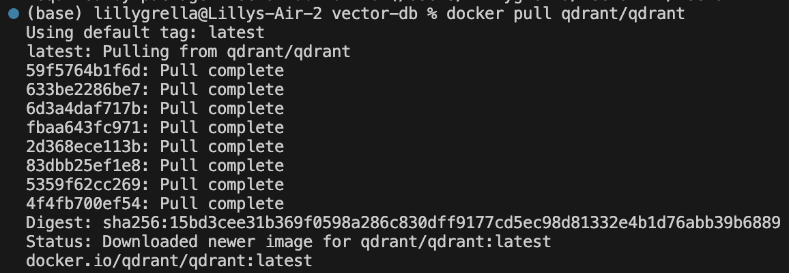
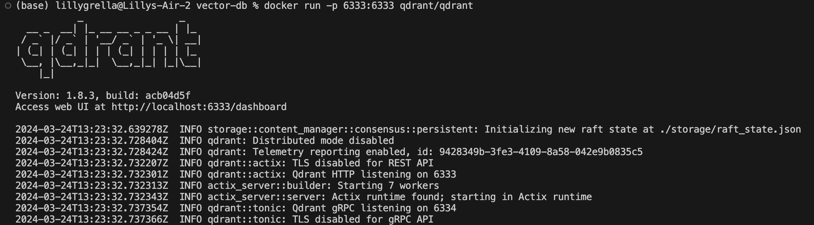
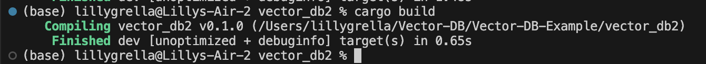
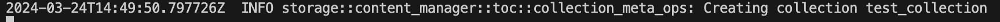
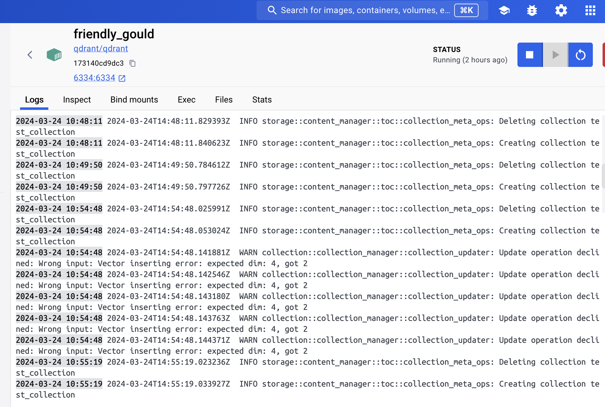
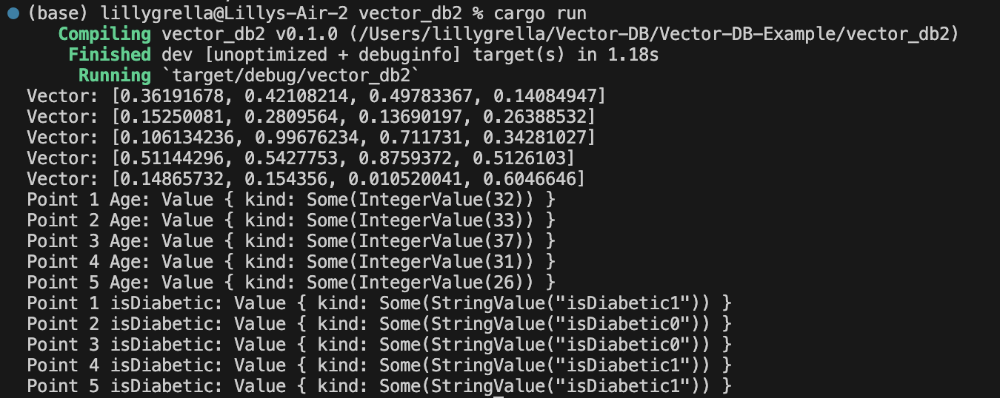

# Vector-DB-Example
Mini Project 7: Creating and Using a Vector Database

## Dependencies
* Rust installed
* Cargo installed
* Qdrant Instantiated
    * To instantiate Qdrant, run the following:
    * docker pull qdrant/qdrant
    * docker run -p 6333:6333 qdrant/qdrant
    * Note: keep this running, run all other commands in a separate terminal

## Create New Rust Project
* To create a shell for a new rust project run: `cargo new {project name}`

## Dependencies
* Update Cargo.toml with all dependencies for the project at hand. For this particular project this includes:
    * anyhow = "1.0.81"
    - qdrant-client = "1.8.0"
    - serde_json = "1.0.114"
    - tokio = { version = "1.36.0", features = ["rt-multi-thread"] }
    - tonic = "0.11.0"
    - rand = "0.8.4"    

## Update src/main.rs
* This is the crux of the project. My steps include:
    * Create a new Qdrant collection (I chose to call it "test")
    * Configure the vector database (including size and how to calculate distance)
    * Ingest the data
        * I chose to use a random generator to create some data for this vector database
    * Query the data
        * To help make the visualization step easier, I created a simple search function that I am able to use to loop through the data to visualize it
    * Visualize the data
        * Using the search query, I loop through all of the records and visualize the age and whether the person is diabetic. (This print out is needed since a random generator is creating those values) 
     
## Run Program
* Run `Cargo run` to see the output

# Screenshots

## Visualization

